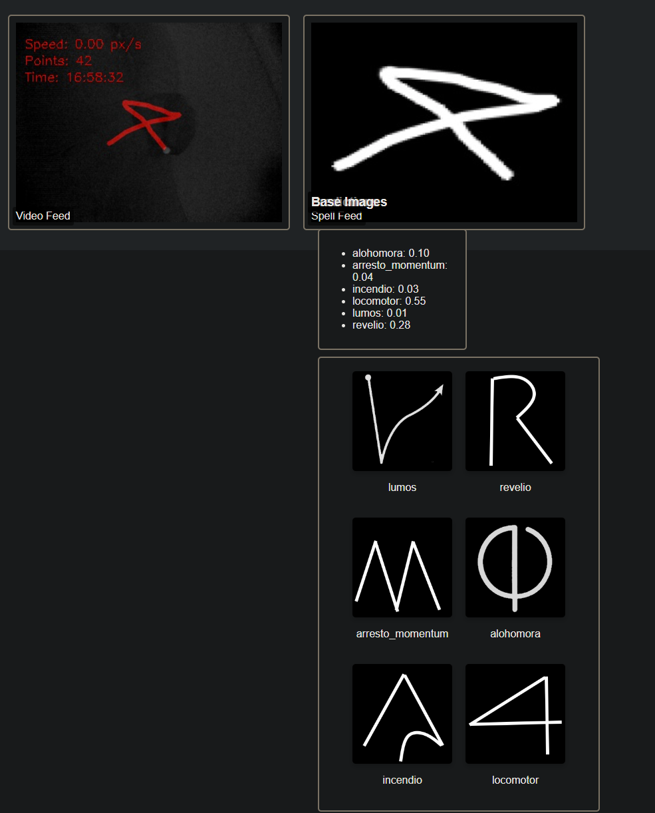

# PiPotter

A raspberry pi camera wand reader, loosely based, yet inspired,  on [Rpotter](https://github.com/sean-obrien/rpotter/blob/master/rpotter.py)


## Architecture



The short version: Using a PiNoir camera, once an IR-reflective wand is detected, a up to 20 traces pattern is recorded. That pattern, a sigil from now on, is passed trough a pre-trained small neural network (EfficientNet B0, see wand folder) and the identified spell is sent to a controller that runs an effect, that may be lights (using the NeoPixel interface) or sound (ffmpeg)
The detection does looks like this, roughly:


## Installation

Firstly, clone the project:
```bash
git clone https://github.com/Esiravegna/pipotter.git
```

### Required hardware

Raspberry Pi 3. It may work in a 2, however, I did not test it. Also,a pinoir camera with led illuminators (the latter may be any other source) are needed. In theory, any IR enabled, picamera compatible camera would do, however, I did not test it.
A sound output for the aforementioned RBpi, and a set of lights based on NeoPixel. You can also use a servomotor.


### On the training machine
See the [Readme](./wand/spell_net2/) in the SpellNet2 folder.

### On the raspberry pi:

```bash
pip install requirements.txt
```


Et voila!

## Usage

Once your prefered effects are set, you can run the server such as:

```bash
 ./run.sh --video-source=picamera
```


This would run the server with the provided config.json. Try

```bash
./run.sh --help
```
for a list of commands.

By default, the webserver is activated so you can see yourself at `http://localhost:8000`.

## Where to go from here

Please refer to each directory for the specific help on configuring your own SpellNet, or the effects, or the like.